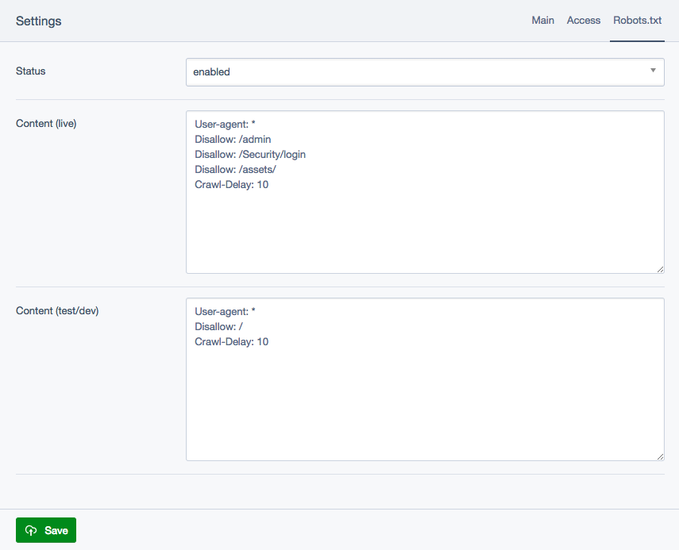

# SilverStripe Robots.txt Documentation

## User guide

On CMS Settings page, a new tab will be added to manage the **robots.txt** file with the options below.
- **Status**
*disabled:* the file will be removed.
*enabled:* the file will be created with the content of the current environment.(SS_ENVIRONMENT_TYPE)
- **Content (live)**
File content for live environment.
- **Content (test/dev)**
File content for test and dev environments.

The file will be created/removed only after save the settings.
